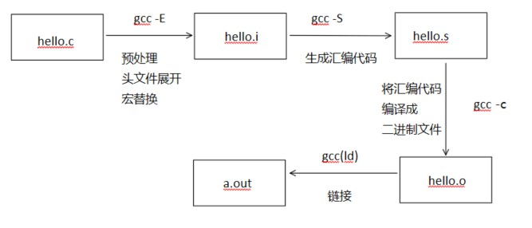
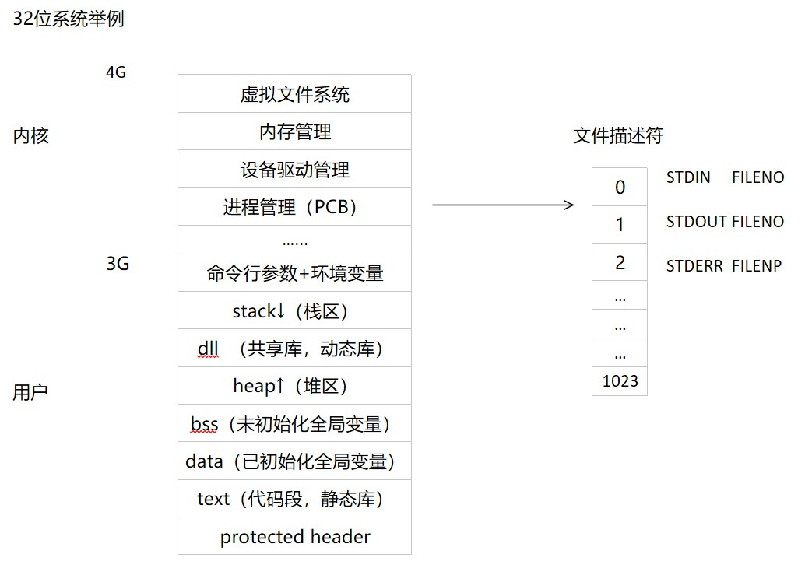

## gcc 编译源代码过程


## gcc 命令及其相关参数
```
  -E            预处理（头文件展开，宏替换）
  -S            生成汇编代码
  -c            将汇编代码编译成二进制文件
  -L            包含库路径(相对路径、绝对路径都可)
  -l            指定库名，（libxxx.so -> -lxxx）
  -I            包含头文件路径
  -o            生成指定的可执行文件名
  -O            优先级1-3
  -D            指定宏编译
  -g            用于gdb调试
  -Wall         显示更多警告
  -lstdc++      编译c++代码（直接g++也可以）
```

## 静态库和动态库概念


### 静态库
##### 静态库命名
```
libxxx.a（lixux） <->  .lib（windows）
```
##### 静态库制作
```
1. gcc -c *.c                ->  生成.o文件(可以用nm命令查看.o文件内容)

2. ar rsc libxxx.a *.o       ->  生成libxxx.a静态库

3. mv libxxx.a ../lib/       ->  发布库和头文件(移动头文件到include, 移动库文件到lib)
```

##### 静态库使用
```
gcc main.c -o a.out -I include/ -L lib/ -lxxx
```

##### 优缺点
```
+1. 执行快
+2. 发布应用时不需要发布库


-1. 代码体积过大
-2. 更新库需要重新编译
```

### 动态库
##### 动态库命名
```
libxxx.so（lixux） <->  .dll（windows）
```

##### 动态库制作
```
1. gcc -c -fPIC *.c              ->  (关键参数-fPIC)编译与位置无关的代码,生成.o文件

2. gcc -shared -o libxxx.so *.o  ->  (关键参数-shared)打包.o文件

3. mv libxxx.so ../lib/          ->  发布库和头文件(移动头文件到include, 移动库文件到lib)
```

##### 动态库使用
```
gcc main.c -o a.out -I include/ -L lib/ -lxxx

动态加载问题解决:
1. 拷贝libxxx.so到/lib下(不推荐)
2. 将库路径增加到环境变量LD_LIBRARY_PATH中(不是很推荐)
3. sudo vim /etc/ld.so.conf, 添加当前lib文件夹的绝对路径, 执行sudo ldconfig -v(常用)

注:ldd a.out可以查看链接动态库情况
```

##### 优缺点
```
+1. 执行程序体积小
+2. 变更库的时候一般不用重新编译

-1. 相对静态库,需要加载,速度慢
-2. 发布应用需要发布动态库
```